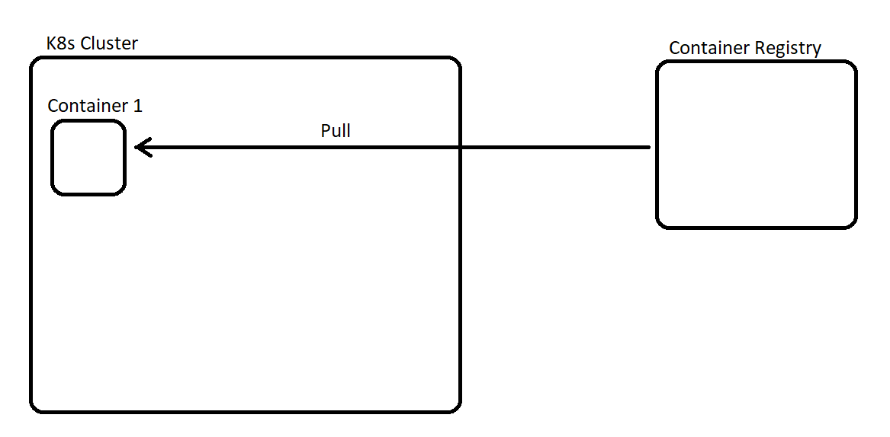

# Session2-kubernetes

Kubernetes clusters come in all shapes and size, and are designed around reliability, resilience and scalability. This does mean it can be fairly complex to get start with a brand new cluster with no previous experience. Thankfully Minikube was developed to help with local development and education purposes. However Minikube is not a HA environment and isnt recommended for production use.

There are numerous stages during this section which are required to have local kubernetes clusters to work, but are NOT typical in standard practice. I will try to highlight any occasion we are doing things for the sake of local dev / minikube specifics as not to confuse with normal k8s practices.

## Setup

### Starting the cluster
Once you have minikube installed, it should automatically discover which container runtime you are using (docker/podman) and allow us to bring up a cluster in a single command:
```
minikube start
```
If required there are additional flags that can be passed to customize the cluster. For this education we will be using a slightly different start up command:
```
minikube start --ports=127.0.0.1:31463:31463
```
This is done as during my testing with podman in WSL2 on windows, its required to allow for our browser to reach our application. This is not usually required on MAC OS as the container running our cluster is running natively and is easily accessed. This is also not something we have to be worried about in a production environment, as the networking aspect will already completed by any administrators.

### Making our image available

Jumping ahead a little, we are going to be running our container in a new isolated environment from our build environment. This is very typical to a real environment, but we are not going to be doing this in a typical manner to make things simpler. But to explain typical behavior first, looking at this image: 



We normally have any container images defined, built and pushed to a registry. From a registry we can pull the image definition and run instances of the container without the need to build. This is important in a k8s cluster as typically a cluster consists of multiple nodes, so we need the image to be easily accessible as the hardware out application is running on could change dynamically.

Kubernetes and minikube do both have a container registry built in to store pulled images in to save network load, but these are normally populated as a container is requested. The first check will be the local registry, then an external one like dockerhub etc. I you run the command `minikube image ls`, you can see what current images are held in your cluster.

So what we want to do to be able to run our application is have access to our image. Some version of minikube will dynamically look at locally built images and make them available to the cluster, but not all. So to be explicit and ensure that our cluster can see the image, we can ask minikube to build and deploy the image to the cluster. So if you are in the directory of this README.md you can run the command:
```
# Its important not to use the tag of latest as by your cluster will always try to 
# pull the latest from dockerhub. Tagging an exact version will prevent this

minikube image build -t namesapp:v1 --all .
```
This will still use your default container runtime to build our application (and compile it using a builder container in this case). Once built, running the `minikube image ls` should now show our image, which by default normally gets tagged to the dockerhub registry `docker.io/library/namesapp:v1`

_Again i would like to highlight this is not typical. It is normally expected to push your containers images to a registry that is accessible to your cluster so it can pull dynamically as needed._

### Accessing the cluster

Minikube does offer a way to run kubernetes commands against the cluster using `minikube kubectl -- XXXX` where XXXX is any normal request, e.g `minikube kubectl -- get pods`. To make your life easier and to look more like normal kubernetes commands you can alias this with something like:
```
alias kubectl="minikube kubectl --"
```
This will allow you to use kubectl "normally". If you already have proper kubectl installed, you can configure it to look at your minikube cluster and avoid doing this.

Running a a `kubectl get pods` should return a message like `No resources found in default namespace.` which means you now have access to  your cluster.

You can now move to the branch `step2-building-our-application` to start setting up our application now we have a cluster to work in