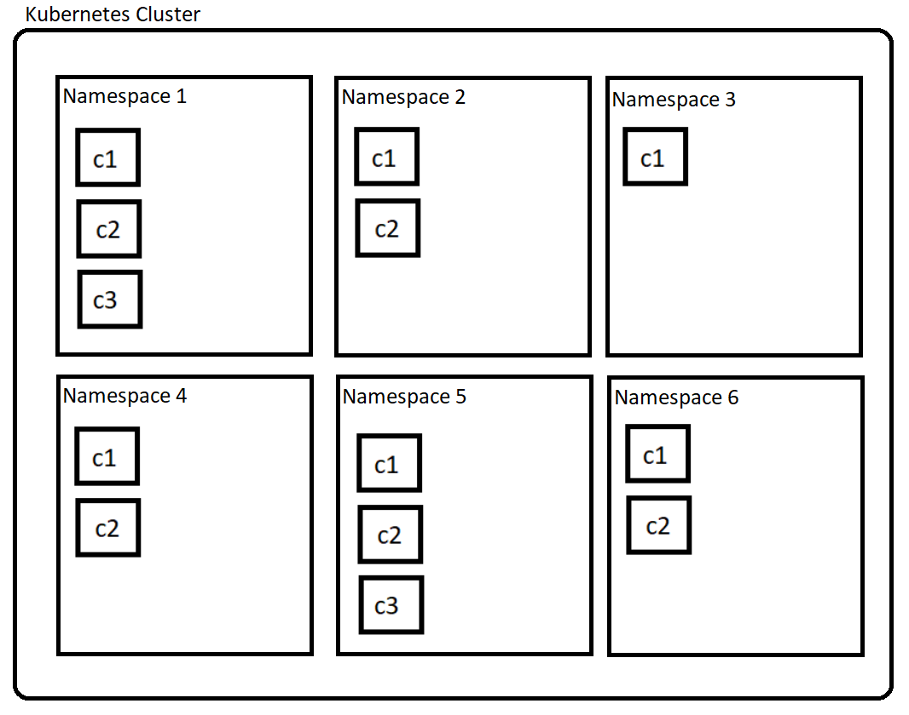

# Session2-kubernetes

This is the starting point for session number 2. This session looks to go through some of the concepts and aims for using a cloud like environment, like Kubernetes.

## Summary of session 1

Before we get started, here is some of the important information that we covered in the last session:
- We covered how to build a container image using a dockerfile
- How to run a container in a local container environment (docker/podman):
    - how to handle container networks to expose and route connectivity through to our application
    - how to use non-ephemeral storage to hold state within an application
- Also quickly looked at how to use containers to perform some work (compiling go code in the last session) rather than just "running an application"


## Concepts

Before we start using a Kubernetes cluster, id first like to go through and explain some of the core concepts and justifications, for at least the components that we will be using today.

### Why is Kubernetes needed?

Normally one of the first questions people ask when getting start with Kubernetes is why do I need it? What does it offer over something like native docker or podman? A lot of it comes down to the more "enterprise" aspect to the runtime, but lets explore some of the major differences.

When we think of a container runtime like a docker engine, this could be a simple server with a docker/podman daemon running. But we want this container runtime to be able to run multiple applications (could be infrastructure/user applications), so we can setup something a little like this:
 


Each app might consist of a few containers (e.g a database, web front end, etc). And this is actually within itself much of an issue. Docker and podman even have the capabilities to put both of these applications on different networks, for separation and security reasons.

But there are several issues that can start to arise:
1. How do I manage team level access to these applications?
1. How do I control scaling my applications?
1. What happens if application 1 can horizontally scale, consuming all the resources of the docker engine?
1. What happens if my application size simply outgrows the size of a single docker engine?

Its questions like this which lead to Kubernetes, as the larger and more complicated our applications/runtimes/team-structure/etc become, the harder and harder it becomes to manage within a docker/podman runtime. So the Kubernetes project was start with the idea of container orchestration focusing on the application level. It provides capabilities and advantages over using a standard docker/podman environment.

To start off, a Kubernetes environment is usually a cluster, looking a little like this:


Where each node (control plane and normal) is its own machine/VM. You can quickly see then how Kubernetes is starting to build a resiliency picture. Having multiple nodes in which I can run containers within allows for simple fail overs. But this isnt the only picture, as this more focuses on the hardware. If we look at a Kubernetes cluster from an application perspective, it looks more like this:



Within a Kubernetes cluster, we have the concepts of a namespace which allows me to logically isolate my application, plus:
- Each namespace has its own logically isolated network
- Access to a namespace can be made role based (RBAC)
- A namespace isn't limited to a single node, so I can run additional instances (replicas) across multiples physical of hardware. (Not even geographically limited)
- Persistent storage is managed by Kubernetes, not the nodes. This means we can have data replication/backup/DR put in place with no additional application requirements.
- Access to Ingressing to allow for simple DNS resolution for applications.
- And so much more!

So in a environment, which is considerable more complex and dynamic than a simple docker engine, how does everything get create, tied together, and held in a working state (especially in the event of a node outage). A good place to start is to describe Kubernetes reconciliation. 

Reconciliation is the name given to the looped logic that drives all the components inside of Kubernetes. It is a cyclical process that starts looking at the desired state of the cluster. Then performing an observation step, retrieves the current state of the cluster. If there are any differences between the desired and observed state, something called a controller will perform actions to move the cluster into a desired state. The process then repeats. It does this for every single type of "object" that is defined within a cluster, normally with a controller specific to each object.

For example, I could have a desired state updated by a user for an application with 2 containers to be expanded to 3. This change in desired state will be detected by a controller which looks at how the state was defined (as this can be done in several ways) which would result in a third container being created dynamically. This process of comparing state whether number of replicas, port numbers, storage size, etc is all completed in a similar fashion.

### Kubernetes Objects

Up until this point I have also referred to out containers as containers, and not the more typical "pod" which you will see in Kubernetes documentation and environment. They have a different name in k8s, as it is actually referring a pod of containers meaning we can have a group of containers within the same network (another sub network of the namespace). However, its is typical to see one container running inside one pod, and usually the multiple containers running inside one pod is a initialization step. We will look at this more later on.

Pods are not the only new object that we will encounter today, but the list of objects supported in kubernetes is quite significant: 
```
bindings
componentstatuses
configmaps
endpoints
events
limitranges
namespaces
nodes
persistentvolumeclaims
persistentvolumes
pods
podtemplates
replicationcontrollers
resourcequotas
secrets
serviceaccounts
services
mutatingwebhookconfigurations
validatingwebhookconfigurations
customresourcedefinitions
apiservices
controllerrevisions
daemonsets
deployments
replicasets
statefulsets
tokenreviews
localsubjectaccessreviews
selfsubjectaccessreviews
selfsubjectrulesreviews
subjectaccessreviews
horizontalpodautoscalers
cronjobs
jobs
certificatesigningrequests
leases
endpointslices
events
flowschemas
prioritylevelconfigurations
ingressclasses
ingresses
networkpolicies
runtimeclasses
poddisruptionbudgets
podsecuritypolicies
clusterrolebindings
clusterroles
rolebindings
roles
priorityclasses
csidrivers
csinodes
csistoragecapacities
storageclasses
volumeattachments
```
And these are just the natively supported ones. So to avoid this session becoming to textbook heavy style of learning about objects, we are going to look/create at today:

```
namespaces
pods
deployments
services
persistentvolumeclaims
persistentvolumes
configmaps
secrets
```
So lets move onto the branch `step1-setting-up-minikube` to get started creating our application in a Kubernetes cluster

